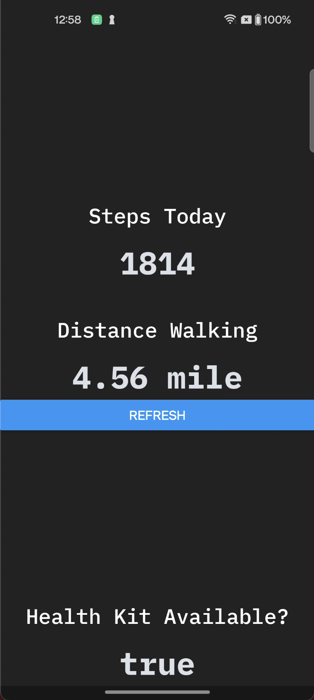
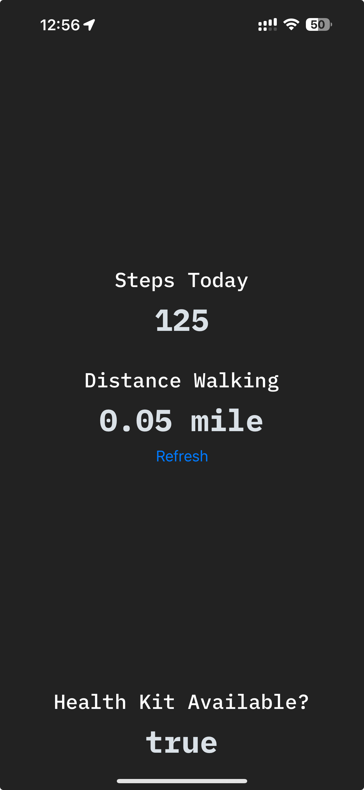

# Steps & Distance App: React Native App

Mobile application developed with **React Native**.

An app that connects with **HealthKit (Apple)** and **Google Fit (Google)** to display the steps and distance from health services.

&nbsp;&nbsp;&nbsp;&nbsp;

## Table of Contents
- [Screenshots](#screenshots)
- [Structure](#structure)
- [Features](#features)
- [Prerequisites](#prerequisites)
- [Dependencies](#dependencies)
- [Installation](#installation)
- [License](#license)

## Screenshots

&nbsp;&nbsp;

## Demo (Gifs)

&nbsp;&nbsp;

## Structure

- `Components`: Essential, reusable building blocks like section.
- `App`: Principal app screen page.
- `hooks`: Reusable hooks.
- `utils`: Utils folder to declare the core utils used in the app, in this case HealthKit

## Features
The current application offers:

- **Health Data**: The application connects to your Apple or Android account to display your health data like Steps or Distance using HealthKit for Apple devices and Google Fit for Google devices.

## Prerequisites
Ensure you have met the following requirements:

* You have installed the latest version of:
	*  `yarn`
   * `.nvmrc`

## Dependencies
The following major dependencies are used in the project:

- React (`react: 18.2.0`) 
- React Native (`react-native: "0.73.6`) as the main frameworks for building the app interface.
- Health Packages (`react-native-google-fit: 0.20.0`, `react-native-health: 1.18.0`) to connect both platform with the Health services for each platform

**Dependencies Documentation:**
- [React Native Google Fit](https://github.com/StasDoskalenko/react-native-google-fit#readme)
- [React Native HealthKit](https://github.com/agencyenterprise/react-native-healthkit#readme)


## Installation
Describe the installation process. Include the step-by-step process.

```bash
# Clone this repository
$ git clone git@github.com:jtvargas/StepsAppRN.git

# Go into the repository
$ cd StepsAppRN

# Install dependencies
$ yarn install

# Start the server
$ yarn start

```
**Prerequisites**: For Android you need to ask the owner of this repo to add your gmail account to the tester list.

### Run the app (**Simulator**)

**iOS**
- Run `yarn ios`

For physical device use xcode

**Android**
- Run `yarn android`


## License
Copyright 2024 © Jonathan Taveras